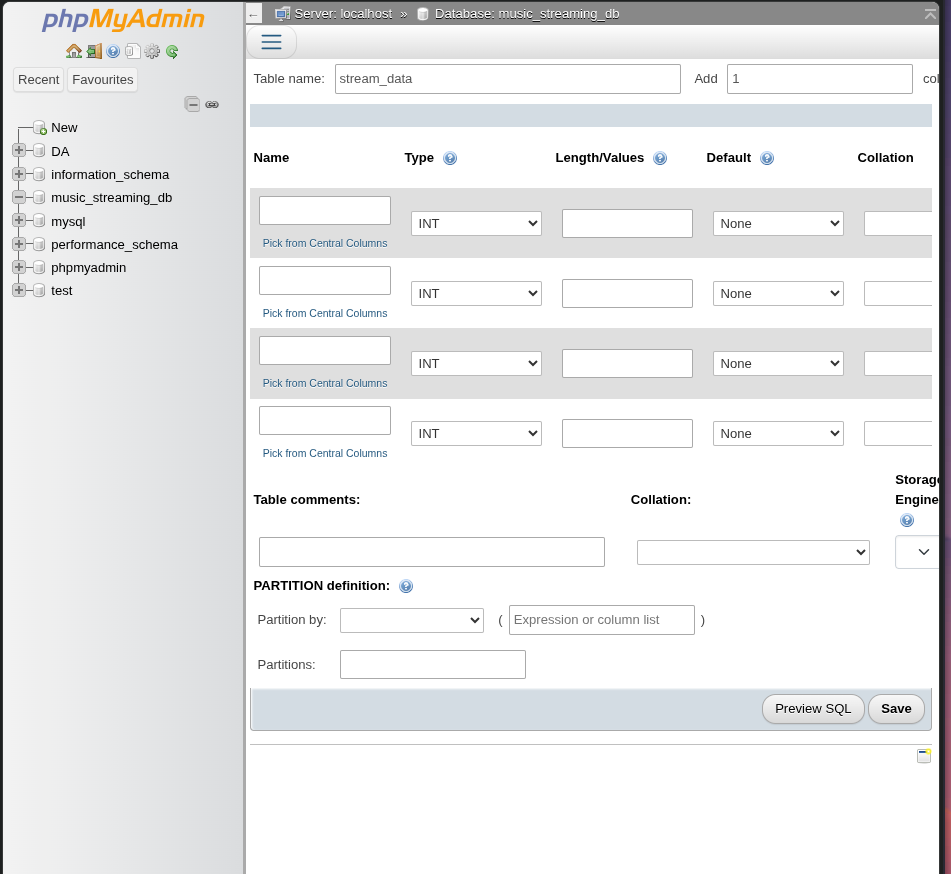
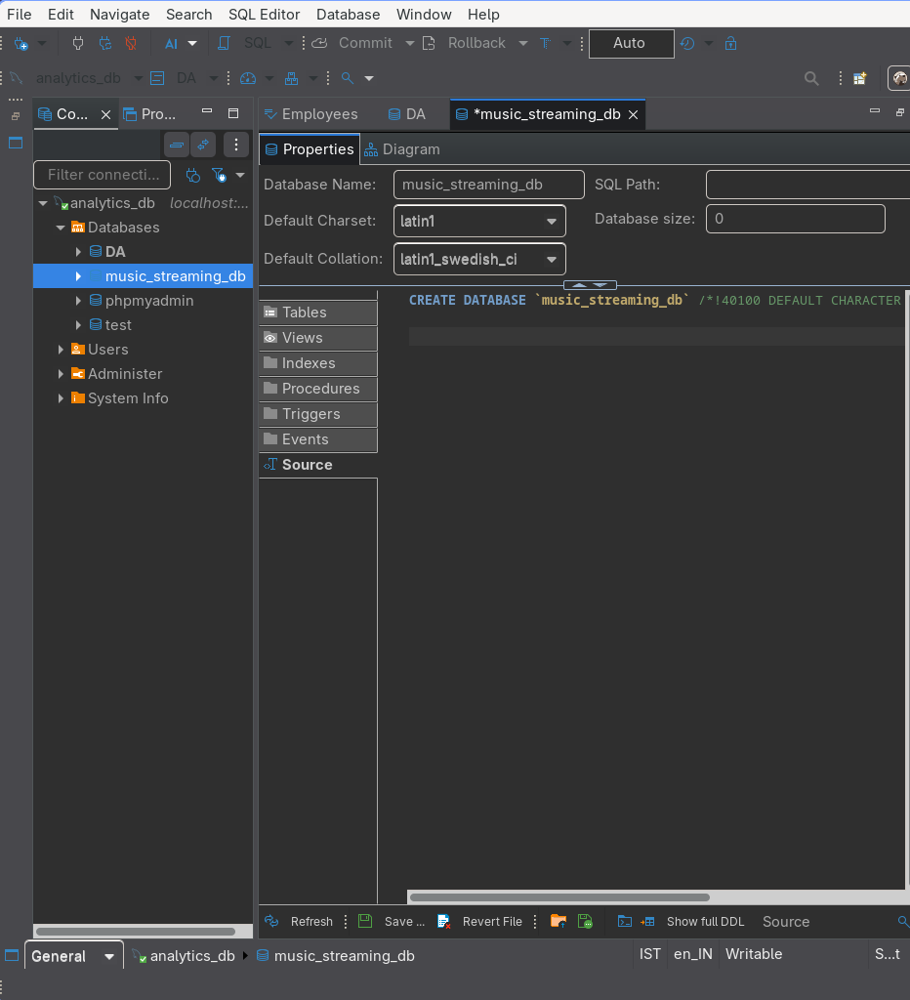
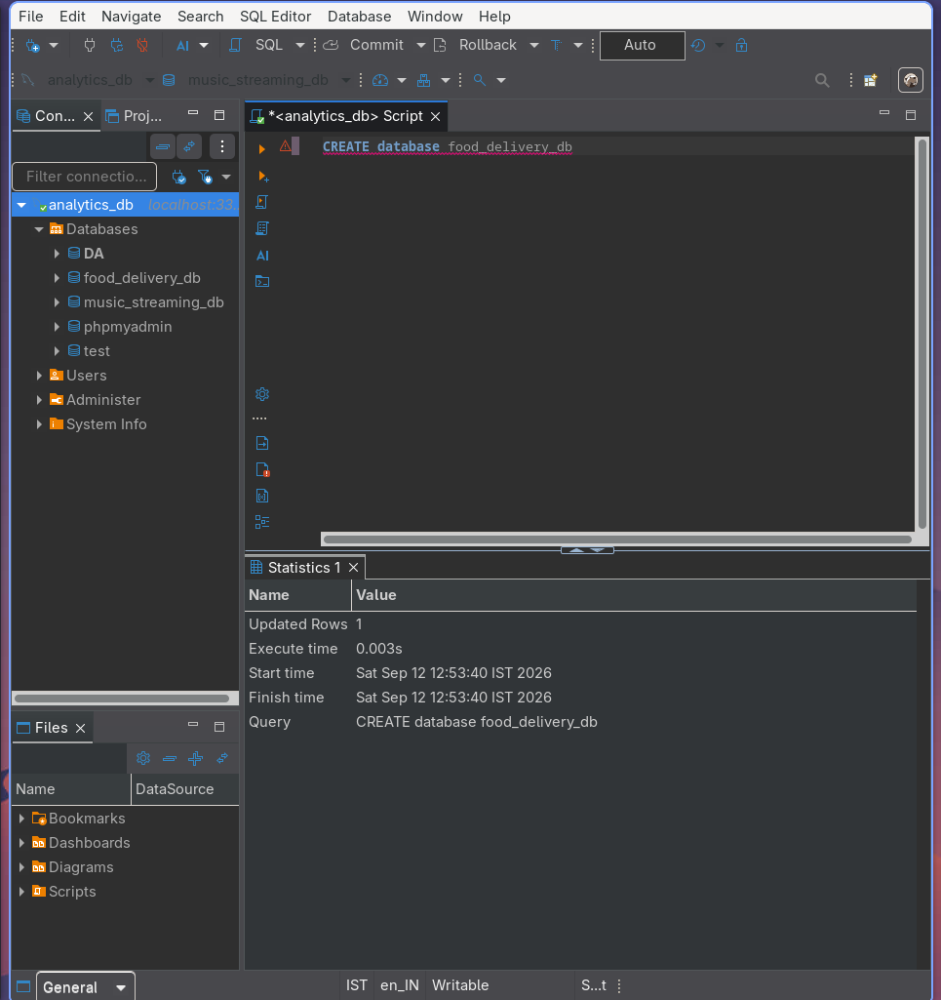

SESSION 1 – Introduction to Databases & Installation
-----------------------------------------------------------

Topics: What is a Database, RDBMS, SQLDB Engines (MySQL, PostgreSQL, Oracle), Installing MySQL / SQL Server using SQL Workbench or DB Browser, Design: Explain why SQL is the backbone of analytics. Demo: Install MySQL? Create database analytics_db.

-------------------------------------------------------------------
Questions / Theory Answers
-------------------------------------------------------------------
1. **What is a Database?**

=> A database is an organized collection of data that can be stored, managed, retrieved, and updated efficiently. Databases are used to store information such as customer details, products, orders, and transactions.

Example: A music streaming application can use a database to store users, songs, artists, playlists, and subscriptions.

2. **What is an RDBMS?**

=> RDBMS stands for Relational Database Management System. It is software used to create and manage databases in which data is organized into tables consisting of rows and columns.

Examples of RDBMS:

MySQL
PostgreSQL
Oracle Database
Microsoft SQL Server

3. **What are SQL Database Engines?**
=> A SQL database engine is the component of a database system responsible for storing, retrieving, and managing data using SQL.

Examples include:

MySQL — widely used for web applications.
PostgreSQL — powerful open-source relational database.
Oracle Database — commonly used in large enterprise systems.
Microsoft SQL Server — widely used in business and enterprise applications.

4. **What is SQL?**
=> SQL (Structured Query Language) is a language used to communicate with relational databases. It can be used to create databases and tables, insert data, retrieve data, update data, and delete data.

Example:

CREATE DATABASE food_delivery_db;

5. **What is MySQL?**
=> MySQL is an open-source relational database management system that uses SQL. It is commonly used for websites and web applications and is often used together with technologies such as PHP.

6. **What is PostgreSQL?**
=> PostgreSQL is a powerful open-source object-relational database management system. It supports standard SQL as well as advanced features such as complex queries, custom data types, extensions, and JSON/JSONB data.

**TASKS**
1. Install MySQL Community Server on your computer and take a screenshot of the MySQL installer completion window.

=> instead of mysqlserver i have installed xamp and started the server on it.

2. Open MySQL Workbench or DB Browser, connect to your local MySQL server, and create a new database called music_streaming_db.

=> since i am on linux i have installed dbeaver and xamp and i have created music_streaming_db on it 

3. Write the SQL command to create a new database named food_delivery_db and execute it in your SQL Workbench or DB Browser.
Hint: Use the CREATE DATABASE statement.

4. List 3 differences between MySQL and PostgreSQL in terms of features or use cases, and give one example of a popular app or company that uses each.

| Difference | MySQL | PostgreSQL |
|---|---|---|
| **1. Complexity** | Generally simpler to learn and configure | Provides more advanced database features |
| **2. Extensibility** | Has good functionality but is comparatively less extensible | Highly extensible and supports custom types, functions, and extensions |
| **3. Use Cases** | Very popular for websites and web applications | Often preferred for complex, data-intensive applications and analytics |
