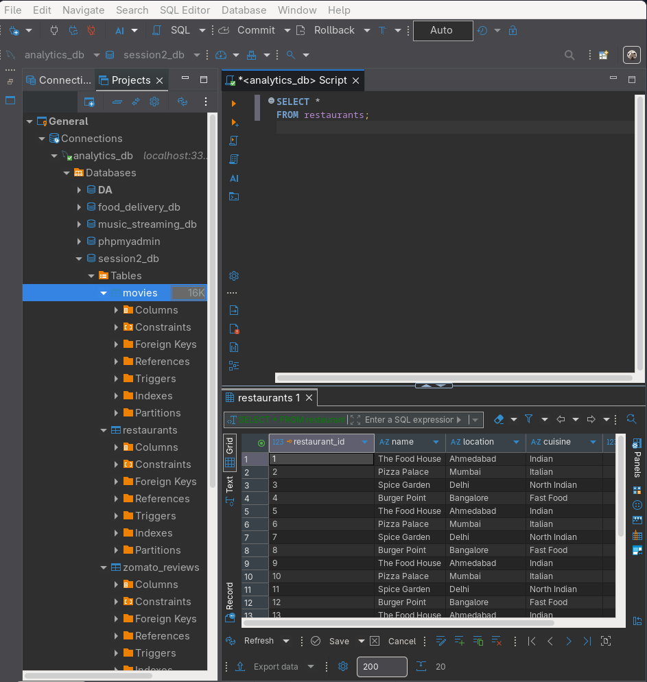
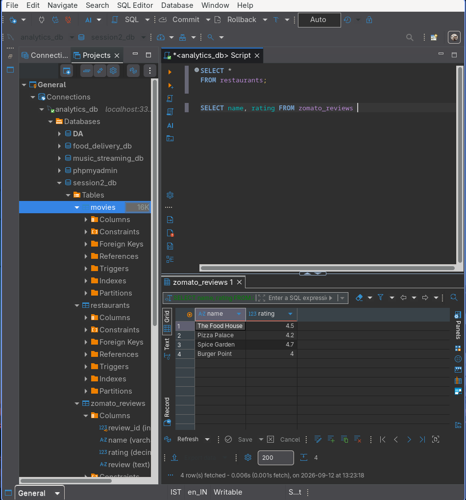
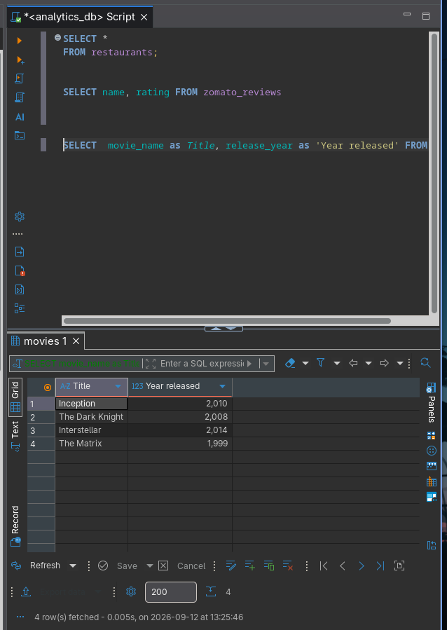
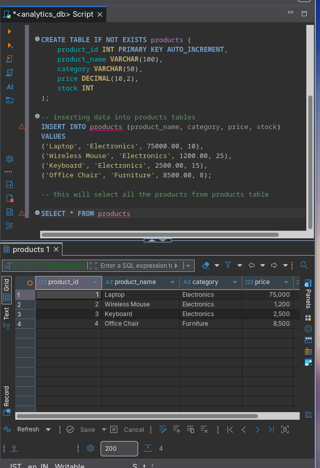

SESSION 2 – Basic SELECT & FROM
Topics:
SELECT column1, column2
SELECT *
Renaming columns (AS keyword)
Comments in SQL
Demo: SELECT * FROM employees;

**TASKS**
Open your SQL editor and run a query to select all columns from a table named restaurants using SELECT * FROM restaurants;

Write an SQL query to display only the name and rating columns from the table zomato_reviews.

Write an SQL query to select the movie_name and release_year columns from a table called movies, but rename movie_name as Title and release_year as Year Released in the output using the AS keyword.

In a table called products, write an SQL query that selects all columns and add a comment in your SQL code explaining what the query does.

