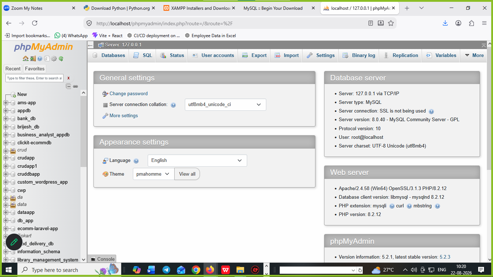
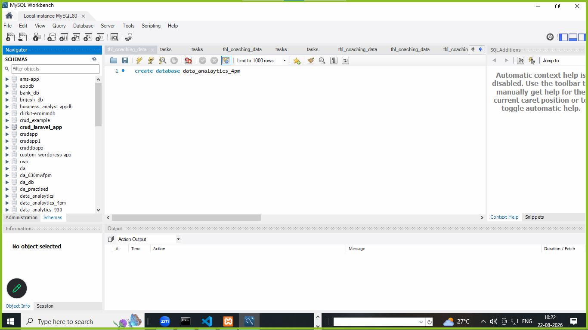
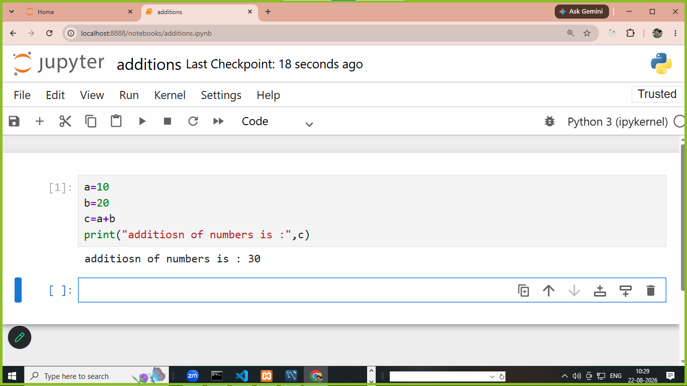
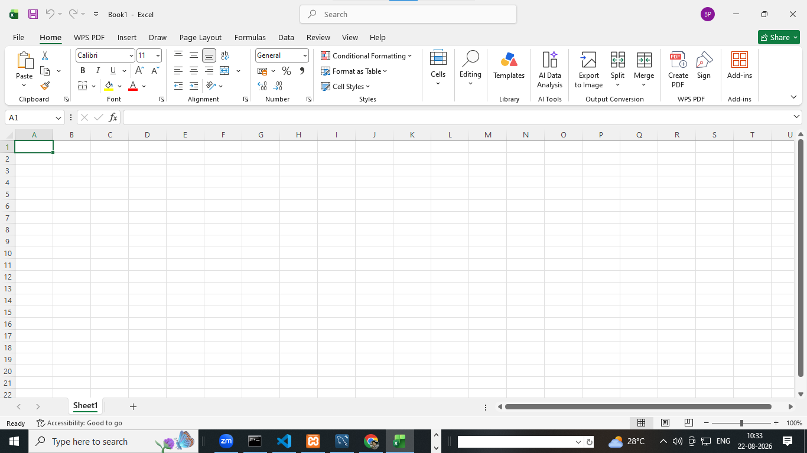
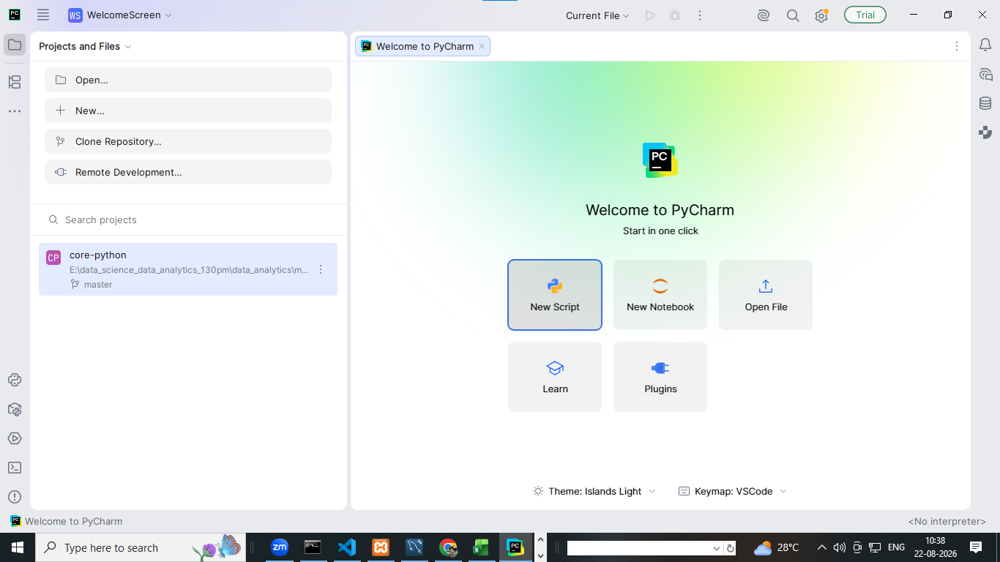
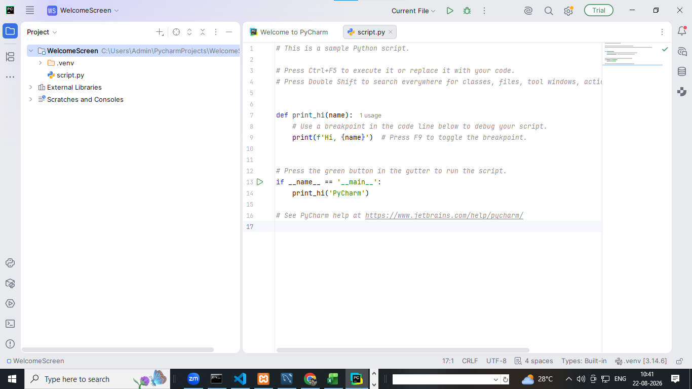
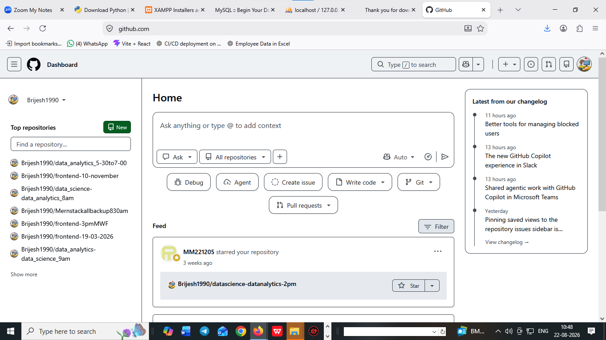

# software installation list

1. install visual studio code (IDE integrated device environment)
```
https://code.visualstudio.com/download?_exp_download=fb315fc982
```
2. python install 
```
https://www.python.org/downloads/
```
# how to check python is install 
cmd: python 

```
Python 3.14.6 (tags/v3.14.6:c63aec6, Jun 10 2026, 10:26:10) [MSC v.1944 64 bit (AMD64)] on win32
Type "help", "copyright", "credits" or "license" for more information.
```

3. download xampp and mysqlworkbench8.0

- xampp install 

```
https://www.apachefriends.org/
```




- mySQLworkbench8.0

```
https://dev.mysql.com/downloads/
```




4. install jupyter notebook

1. required python installed in your systems 
2. how to install jupyter notebook
3. pip install jupyter notebook 
4. jupyter notebook

**screenshot**




5. verify excel in your systems 



6. download and install pycharm 

```
https://www.jetbrains.com/pycharm/download/
```

1. verify install or not



2. create project on pycharm and verify




7. create account on github.com

1. create account on github.com via gmail.com or google
2. login in github.com
3. create a new repository on github

```
https://github.com/
or
https://github.com/Brijesh1990/data_analytics-data_science_930am_TTS.git
```



# github commands for upload data on github server

1. git init
2. git add .
3. git commit -m "first commit"
4. git branch -M master
5. git remote add origin https://github.com/Brijesh1990/data_analytics-data_science_930am_TTS.git
6. git push -u origin master